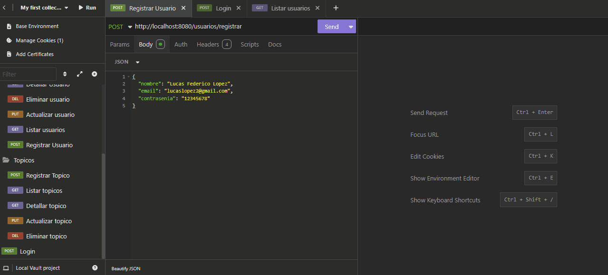
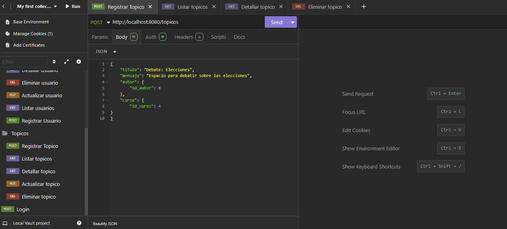
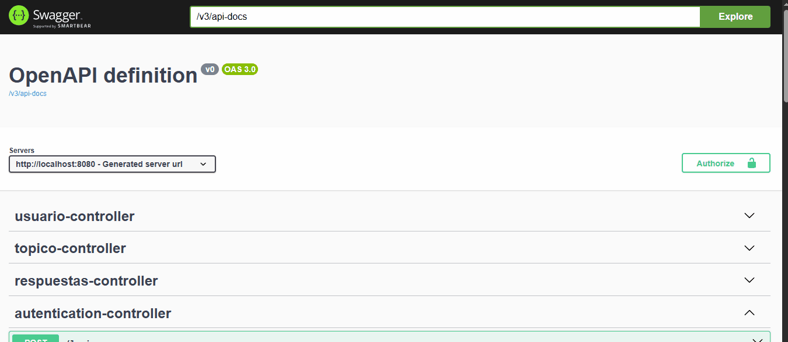

# Challenge ForoHub - Alura Latam 🚀

<p>
   
   
   
   
</p>

## 📝 Descripción

Bienvenido al repositorio de **ForoHub**, una API RESTful desarrollada como parte del desafío Back End de **Alura Latam**. El objetivo principal es replicar la funcionalidad del foro de Alura, permitiendo la gestión de tópicos, usuarios y respuestas, todo asegurado mediante autenticación JWT y persistencia en base de datos relacional.

La aplicación permite a los usuarios:
- Gestión completa (CRUD) de Tópicos, Usuarios y Respuestas.
- Autenticarse y recibir un token JWT para acceder a las rutas protegidas.
- Validar reglas de negocio y manejo de errores personalizado.
- Documentación automática de la API con Swagger.

---

## ⚙️ Tecnologías y Herramientas

* **Java 17**: Lenguaje de programación.
* **Spring Boot 3**: Framework para el desarrollo backend.
* **Spring Security**: Gestión de autenticación y autorización.
* **Auth0 JWT**: Generación y validación de tokens JSON Web Token.
* **Spring Data JPA / Hibernate**: Mapeo objeto-relacional (ORM).
* **Flyway**: Control de versiones y migraciones de la base de datos.
* **MySQL**: Base de datos relacional.
* **Lombok**: Reducción de código repetitivo.
* **SpringDoc / Swagger**: Documentación interactiva.
* **Maven**: Gestor de dependencias.

---

## ✨ Funcionalidades

### 1. Autenticación de Usuarios
- Login con correo y contraseña.
- Generación de Token JWT con expiración de 2 horas.

### 2. Gestión de Tópicos
- **CRUD Completo:** Crear, Listar, Actualizar, Detallar y Eliminar tópicos.
- **Validaciones:** Evitar tópicos duplicados (mismo título y mensaje).

### 3. Gestión de Usuarios
- Registro de nuevos usuarios y administración de perfiles existentes.

### 4. Gestión de Respuestas
- Los usuarios pueden publicar respuestas a los tópicos, editarlas o borrarlas.

---

## 🖥️ Demostración de la API

### Autenticación (Registro y Login)
Obtención del Token Bearer para autorizar las peticiones.


### Gestión de Tópicos
Creación de un tópico, mostrar los tópicos disponibles, detallar un tópico y eliminarlo.


### Documentación Swagger
Interfaz gráfica autogenerada para probar los endpoints.


---

## 🔧 Configuración y Ejecución

1.  **Clonar el repositorio:**
    ```bash
    git clone [https://github.com/LucasFedericoLopez/ChallengeForoHub.git](https://github.com/LucasFedericoLopez/ChallengeForoHub.git)
    ```

2.  **Configurar Base de Datos:**
    Asegúrate de crear una base de datos en MySQL y configurar las variables de entorno en `application.properties` (`DB_HOST`, `DB_USER`, `DB_PASSWORD`, `JWT_SECRET`).

3.  **Ejecutar:**
    Al iniciar, Flyway creará las tablas automáticamente. Ejecuta `ApiForoHubApplication.java`.

4.  **Swagger:**
    Accede a `http://localhost:8080/swagger-ui.html`.

---

## 📨 Listado Completo de Endpoints

Todos los endpoints (excepto Login y Registro) requieren el header `Authorization: Bearer <token>`.

### 🔐 Autenticación
| Método | Endpoint | Descripción |
|---|---|---|
| `POST` | `/login` | Autenticar usuario y obtener Token JWT |

### 📚 Tópicos
| Método | Endpoint | Descripción |
|---|---|---|
| `POST` | `/topicos` | Registrar un nuevo tópico |
| `GET` | `/topicos` | Listar tópicos activos (paginado) |
| `GET` | `/topicos/{id}` | Ver detalle de un solo tópico |
| `PUT` | `/topicos/{id}` | Actualizar título o mensaje de un tópico |
| `DELETE`| `/topicos/{id}` | Eliminar un tópico |

### 👤 Usuarios
| Método | Endpoint | Descripción |
|---|---|---|
| `POST` | `/usuarios/registrar` | Registrar un nuevo usuario (público) |
| `GET` | `/usuarios` | Listar todos los usuarios |
| `GET` | `/usuarios/{id}` | Ver detalle de un usuario |
| `PUT` | `/usuarios/{id}` | Actualizar datos de un usuario |
| `DELETE`| `/usuarios/{id}` | Eliminar un usuario |

### 💬 Respuestas
| Método | Endpoint | Descripción |
|---|---|---|
| `POST` | `/respuestas` | Crear una respuesta para un tópico |
| `GET` | `/respuestas` | Listar todas las respuestas |
| `GET` | `/respuestas/{id}` | Ver detalle de una respuesta |
| `PUT` | `/respuestas/{id}` | Actualizar el mensaje de una respuesta |
| `DELETE`| `/respuestas/{id}` | Eliminar una respuesta |

---

## 👤 Autor

**Lucas Federico Lopez**

Desarrollado durante el programa Oracle Next Education (ONE) con Alura Latam.

---